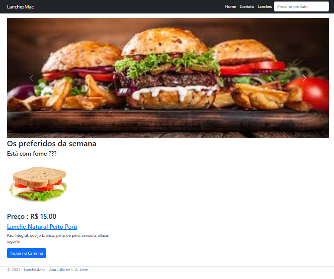

# ASP .NET MVC


        

      
          
Este curso foi feito para colocar em prática os conhecimentos em **ASP .NET MVC** em um site para vendas de lanche funcional. Vou criar do zero um site web dinâmico e aprender diversos conceitos relacionados ao desenvolvimento web usando a tecnologia **ASP .NET MVC** e o **Entity Framework Core**. Vou aprender a implementar o padrão **MVC**, definir as entidades do modelo de domínio usando o **Entity Framework Core**, definir a validação e configuração das entidades usando o **Data Annotations**, realizar a migração para criar o banco de dados e as tabelas usando a abordagem **Code-First**, cadastrar as tabelas do banco de dados, usar o padrão repository e o padrão **ViewModel**, trabalhar com **Session** criando um carrinho de compras, definir rotas na aplicação, usar **Views Components** no projeto, implementar a segurança usando **ASP .NET Core Identity** criando o Login, o registro e o Logout do usuário, criar e usar o **Partial Views**, realizar a paginação e filtro de dados, criar relatórios criando consultas **LINQ**, criar gráficos usando o **GoogleChart**, criar relatórios no formato PDF usando o **FastReport OpenSource**.

## Tecnologias Utilizadas

- ASP.NET Core MVC
- C#
- Entity Framework Core
- SQL Server
- HTML5
- CSS3
- Bootstrap
- JavaScript
- Visual Studio 2022

---

## Instrução para Executar

Clone este repositório:
```bash
git clone https://github.com/anajulialeite/ASP-.NET-MVC.git
```
Navegue até a pasta do projeto:
```bash
cd ASP-.NET-MVC
```
Restaure as dependências:
```bash
dotnet restore
```
Compile o projeto:
```bash
dotnet build
```
Execute a aplicação:
```bash
dotnet run
```
Acesso no navegador:
```bash
https://localhost: XXXX
```

---

## Pré-requisitos

- .NET SDK Instalados
- Um editor como Visual Studio 2022 ou Visual Studio Code

---

## Funcionalidades Implementadas

<li>Cadastro e login de usuários</li>
<li>Visualização de tipos de lanches</li>
<li>Página de contato funcional</li>
<li>Busca de lanches por nome</li>
<li>Registro de novos usuários</li>
<li>Integração com banco de dados SQL Server</li>

---



## Autora: Ana Júlia de Lima Aguiar leite

<a href="https://www.linkedin.com/in/ana-j%C3%BAlia-de-lima-aguiar-leite-009a58209/" target="_blank">

https://www.linkedin.com/in/anajulialimaleite/

---

## license

[](./LICENSE)
